# YaCy Demonstration

We have screenshots, tutorial movies, and a live demonstration. If you want to jump to the section where we show where we took the beautiful teaser image from, jump to the [peer-to-peer network activity dashboard](#network-activity)!

<a class="btn btn-default btn-sm pull-right" href="https://github.com/yacy/yacy_net_homepage/blob/master/docs/demonstration_tutorial_screenshot.md" role="button" target="_blank">Improve this doc</a>

## Screenshots
.. the best way to show what you get ..

### Search Results

This is the search results page using peer-to-peer data:

Search result pages can be configured:
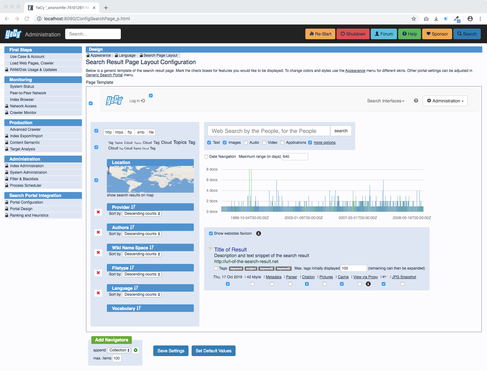

We provide a wide range of options to integrate a search page into an existing environment:
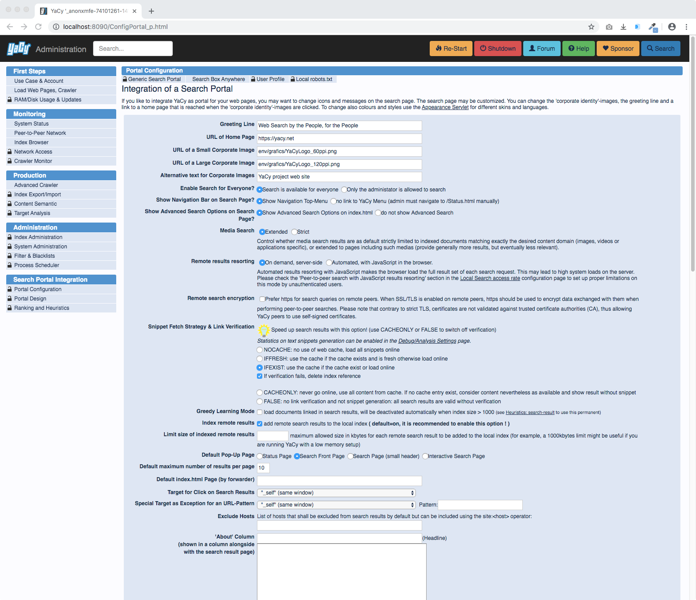

There are many pre-defined themes and an easy way to configure your own colour schema:
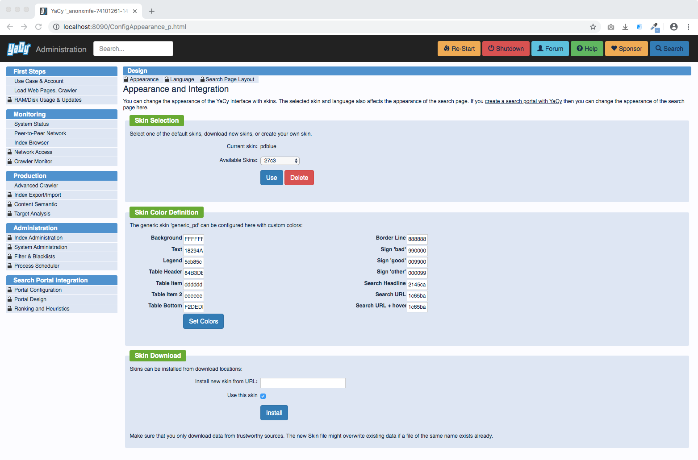

Search result ranking can be configured:
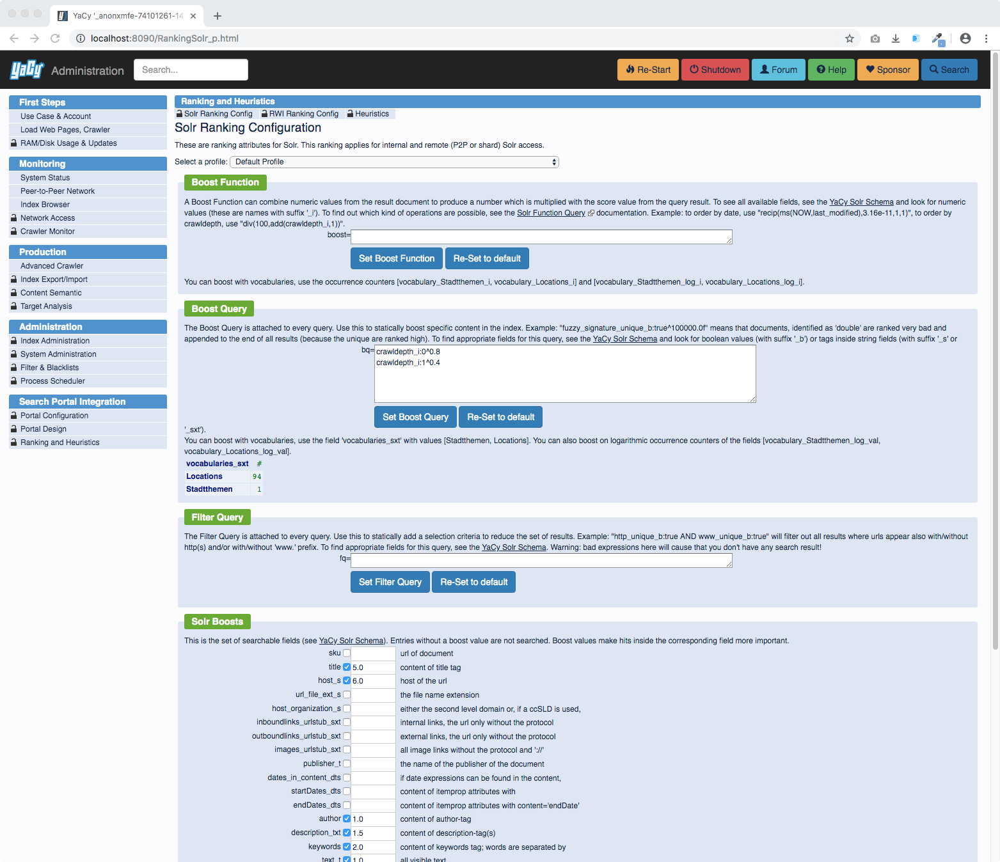

### Crawling

Before search results can be provided, a web crawl must be done to harvest the required document corpus.

There is a easy-to-use simple crawl start service which takes almost only the starting URL as input:
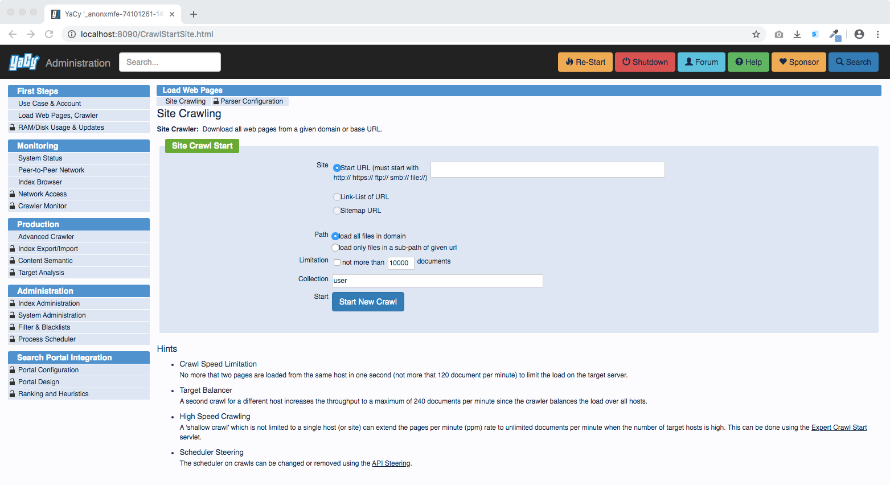

A running crawl can be monitored in many ways, here is the crawler status dashboard:

For more complex harvesting tasks, here is the Expert Crawl Start service:
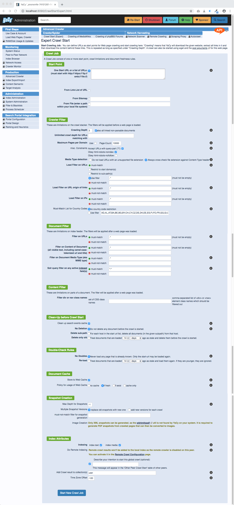

### Data Analysis

A running YaCy instance has many management tasks running and it creates a lot of data.
To visualize that data about itself and the data it harvested from the internet, there are a lot of
dashboards and monitoring features.

The status page which informs about the current activities of your YaCy instance:
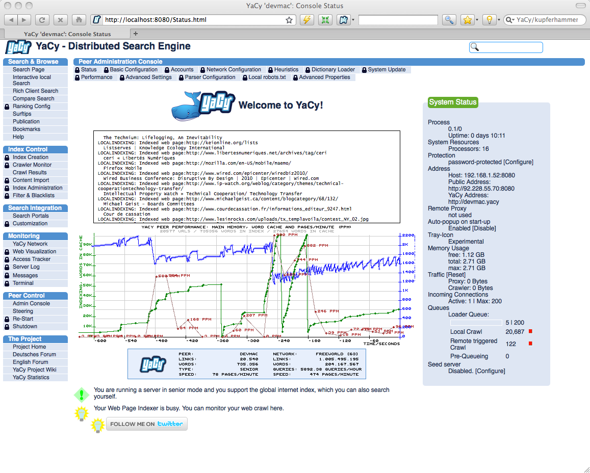

Crawled web pages can be reconstructed and browsed with the host browser where you see the internal link structure and all kind of details of the parsing results:

While the host browser reveals the structure of documents within all of the single domains, the web
structure service shows how domains are linked to each other:
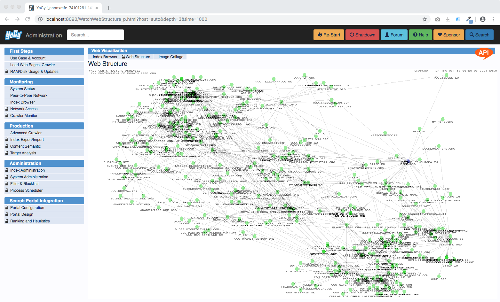

### Configuration

YaCy can be configured in every detail using the web interface. You can use a configuration file and also edit details inside of that file, but a web front-end is much more convenient.

Here you see the use case configuration. This is actually the first service which YaCy shows to you because the first thing you have to do is to choose which use case you are prefering: Peer-to-Peer operation, your own Search Portal, or Intranet Indexing:
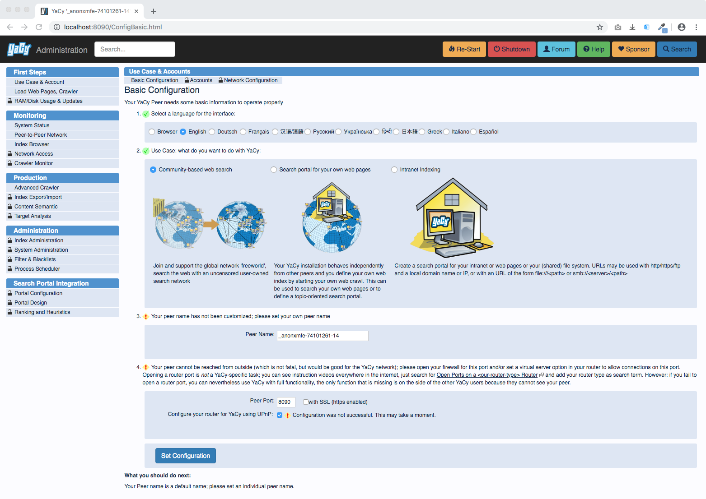

The main purpose of YaCy is to aquire a lot of data from the web and make
them searchable.  Consequently, this uses a lot of disk space.  We make the
resources which YaCy takes configurable with the following service.  YaCy
loves to use more RAM if available, give it more RAM and it performs better!

### Network Activity

YaCy makes a lot of network connections and it is transparent about doing that.

In case you are running YaCy in peer-to-peer operation, you can watch the network graphic here:
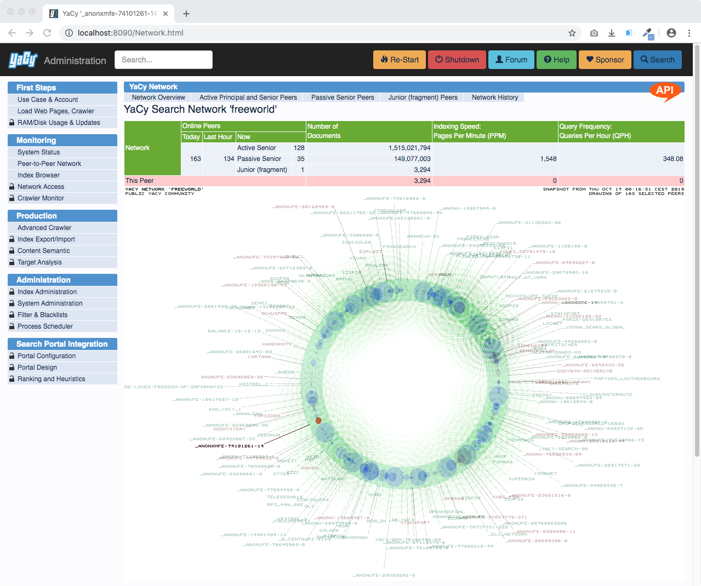

The peer-to-peer network can be investigated in detail in a table:
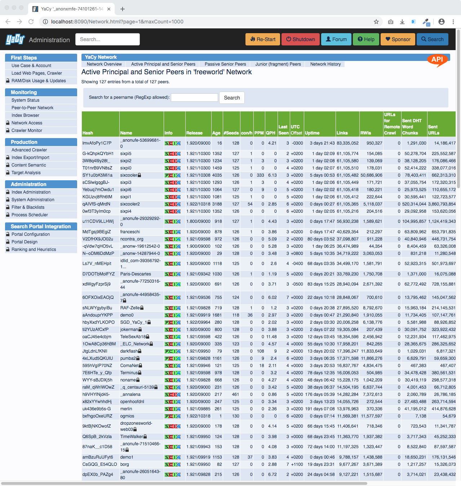

Every connection that YaCy does, peer-to-peer or crawling, is monitored as well:
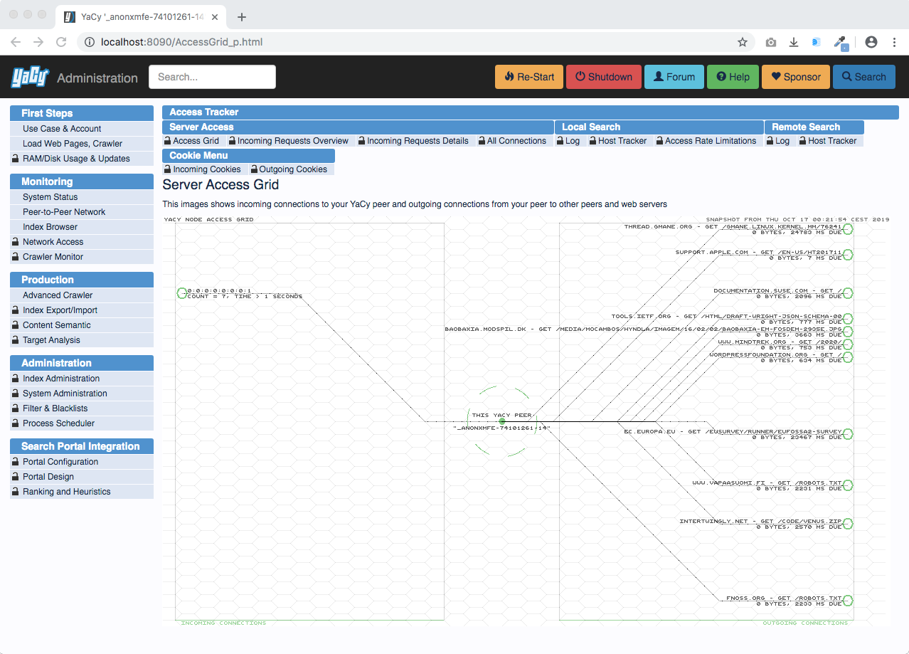

## Tutorial Movies

We have a YouTube channel! Yes, thats a Google service - therefore all videos embedded here are mouseover-activated, that means as long as you do not touch them, there is no referrer appearing at a G server.

These videos are short and most have nice music from [Shiryu Music](https://shiryu.bandcamp.com/) in the background. Shiryu is just great and inspiring! 

<a class="btn btn-danger btn-lg" href="https://www.youtube.com/yacy_tutorials" role="button">Subscribe to the YaCy Tutorial Youtube channel</a>

### Demo: YaCy Installation in Windows
Please install Java 11 (or higher) first, the automatic Java installation within YaCy does not work any more.

### Demo: YaCy Installation on a Mac

### Demo: YaCy Installation in Ubuntu and any other Linux Systems
Instead of Java 7 now please install Java 11 (or higher)

### Demo: Basic Configuration of YaCy and Release Updates

### Demo: Start a Web Crawl with YaCy

### Demo: Secret Agents with YaCy RSS Feed Reader

### Demo: Location Search with YaCy and Openstreetmap and Geonames

## Live Demonstration

Well, YaCy is all about running your own search engine, not using a central one. Therefore we highly recommend you download and try out your own YaCy instance instead of trying this demonstration. Therefore, please consider this demonstration not as production-grade search portal, just as help to find out what YaCy is and how it looks.

We provide here a link to the administration page of the test instance where you can also find your way to the search page. Administration functions are disabled but you are able to browse through the services without a password:

### YaCy Demo Peer

<a class="btn btn-default btn-lg" href="https://yacy.searchlab.eu/Status.html" role="button">Click here to operate a YaCy Demo Peer</a>

