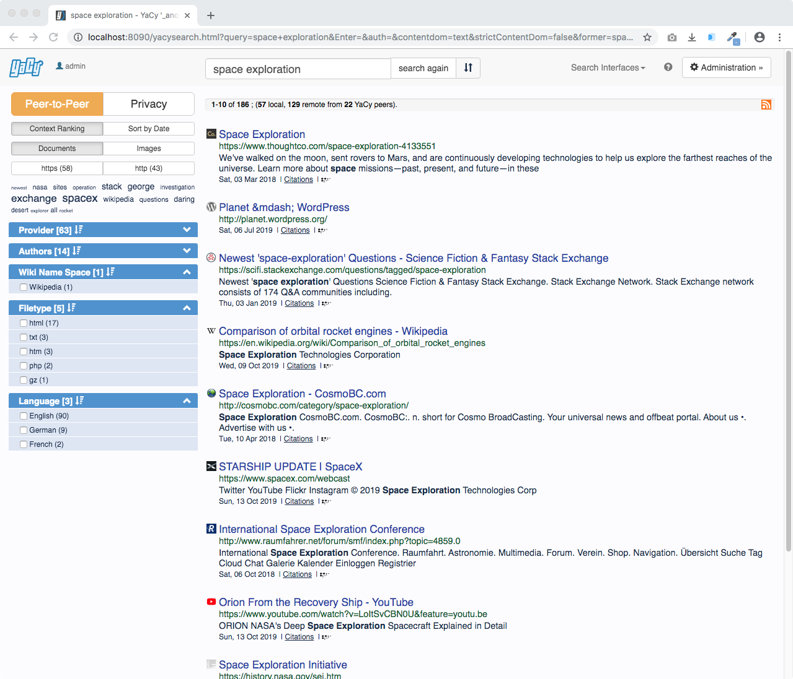

disable_toc: true

<section class="home-hero">
  

    
    <h1>YaCy is free software for your own search engine.</h1>
    
YaCy is free search engine software for local search, organization-wide search portals, and a decentralized peer-to-peer web index.

    

      <a class="btn btn-success btn-lg" href="/download_installation/" role="button">Download YaCy</a>
      <a class="btn btn-default btn-lg" href="https://yacy.searchlab.eu/Status.html" role="button">Try Demo</a>
    

  

  

    
  

</section>

## Choose how you want to use YaCy

Run YaCy locally, build a search portal for your organization, or join the decentralized peer-to-peer search network.

  

    <h2>P2P Mode</h2>
    
    
Web Search by the people, for the people: decentralized, all users are equal, no central, no search request storage, shared index.

  

  

    <h2>Your Search Portal</h2>
    
    
Your YaCy installation is independent from other peers. Define your own web index and start your own web crawl.

  

  

    <h2>Intranet Search</h2>
    
    
Create a search portal for your intranet, web pages or your (shared) file system.

  

## Decentralization
YaCy does not depend on a central search provider. In peer-to-peer mode, many independently run devices contribute to a shared search index, so no single company or server controls the network.

Here is a live image of the YaCy network:

      

