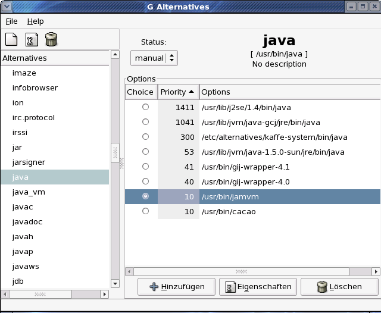

# GNU Install

YaCy needs a Java Runtime Environment to run. Since YaCy was operated
under Sun's proprietary [JRE](http://java.sun.com/) at first, it
currently works best with it. However efforts are underway to make YaCy
runnable with free software JVMs.

## YaCy with Kaffe

  - YaCy starts
  - Network functions seem not to be implemente complete and/or
    compatible, see [forum
    post](http://www.yacy-forum.de/viewtopic.php?t=2919)

## YaCy with GCJ (compiler)

To build with gcj it suffices to run Ant with the option
-Dbuild.compiler=gcj or create a file named ant.properties in your which
contains the line "build.compiler=gcj". With Debian GNU/Linux, Ubuntu &
Fedora Core it suffices to not install a proprietary Java Runtime (GCJ
is the default on these systems).

### MacOS X

Install [Darwinports](http://www.darwinports.com), [GCJ for
Darwinports](http://gcj34.darwinports.com) and [GNU Classpath for
Darwinports](http://gnu-classpath.darwinports.com).

## YaCy with GIJ (runtime)

YaCy starts and runs

after approx. 2 hours an OutOfMemoryError occurs

**TODO:** Find out why

### Instructions

To run YaCy using [GNU](http://gcc.gnu.org/java)s Java Virtual Machine
(suggested version: 4.1.1 which is roughly equivalent to JDK 1.4.2), 2
preconditions must be met:

1.  YaCy should be compiled with ECJ (the commandline compiler from the
    Eclipse project)
2.  YaCy needs [Ant](http://ant.apache.org/) to compile

#### Installation of ECJ

ECJ is available for most distributions and can be installed via the
package management.

#### Installation of Ant

One can install Ant by following the instruction on the website above or
by using the distributions package management system.

### Debian

In Debian & Ubuntu JVMs are managed through the 'alternatives' system.
You can chose the wanted virtual machine by running
"update-alternatives" or graphically through "galternatives".

### modify YaCy init script

To change to VM for YaCy only, you can edit the init script since
version 0.38 or SVN revision 2696 by changing the line containing
JAVA="\`which java\`" with JAVA=/usr/bin/gij In older versions you need
to replace all occurances of "java" with the name of your alternative
VM.

**TODO:** Eventually a set `JAVA_HOME` must be delete by calling `unset
JAVA_HOME`?

#### Installation of YaCy

Because of an uninspected inconsistency between Sun's JRE 1.4.2 and GIJ
YaCy's function to test for a compatible Java version fails. To prevent
an immediate exit of YaCy comment the line containing `System.exit(-1);`
in source/yacy.java in method `startup(String homePath, long
startupMemFree, long startupMemTotal)` out.

If both ant and ecj installed one can start YaCy's compilation by
calling:

    ant compileMain

At the moment it is needed to run YaCy on GIJ with the following command
line because it uses a different parameter syntax than the JDK:

    gij --mx=128m -cp classes:.:lib/commons-collections.jar:lib/commons-pool-1.2.jar:lib/svnRevNr.jar yacy

**TODO:** AFAIK gij understand "-Xmx" as well

## YaCy with JamVM / Classpath

*not tested yet*

## YaCy with Cacao / Classpath

*not tested yes*

_Converted from
<http://wiki.yacy.de/index.php?title=En:GNUInstall>, may be
outdated_

