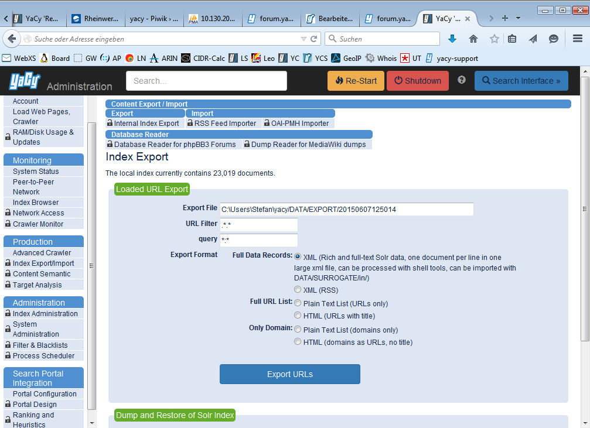
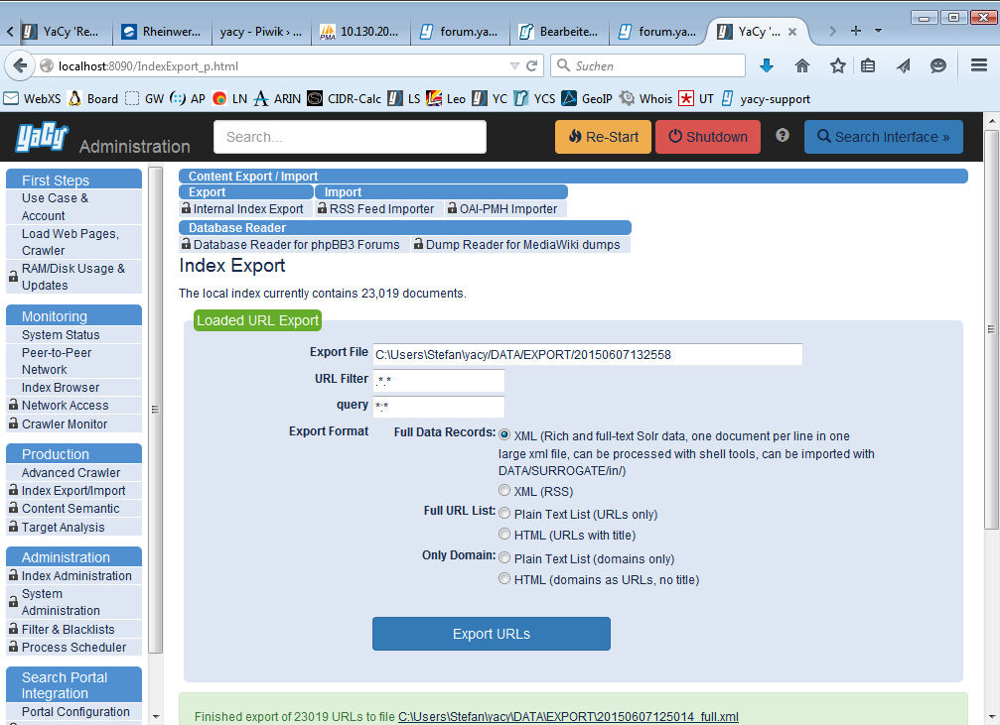

# Index export and import

Since the development version 1.83 build 9250 YaCy has now the long
awaited feature to handle the index data in a more convenient way: An
ex- and import feature has been implemented.

It is no longer necessary to study complicated manuals for the merge of
two solr indexes and/or setup an additional stand-alone instance for
index merging tasks - thanks to the great work of Orbiter - YaCy
delivers now a powerful ex- and import feature out-of-the-box\!

## How to do that? 

Here's a short tutorial:

]

1\. On the machine you want to export the index data open a browser and
navigate to <http://localhost:8090/IndexExport_p.html>

Leave the settings as is, XML (Rich and full-text Solr data, one
document per line in one large xml file, can be processed with shell
tools, can be imported with `DATA/SURROGATE/in/`) because it's the best
choice for the consistency of your data.

2\. Press the 'Export URLs'-Button and grab some coffee :-)

3\. On the machine you want to import the index data, simply put the
exported XML file into the following subdirectory of YaCy: `\DATA\SURROGATES\in`

You can do this during YaCy is running - No need to shut it down first\!

4\. Voilà - The import process starts automatically and is blazing fast
- even on older machines. After the import process is completed, you can
search trough the data instantly - reindexing is superfluous.

_Converted from
„<http://wiki.yacy.de/index.php?title=En:IndexExpImp&oldid=22656>“, may be
outdated_

